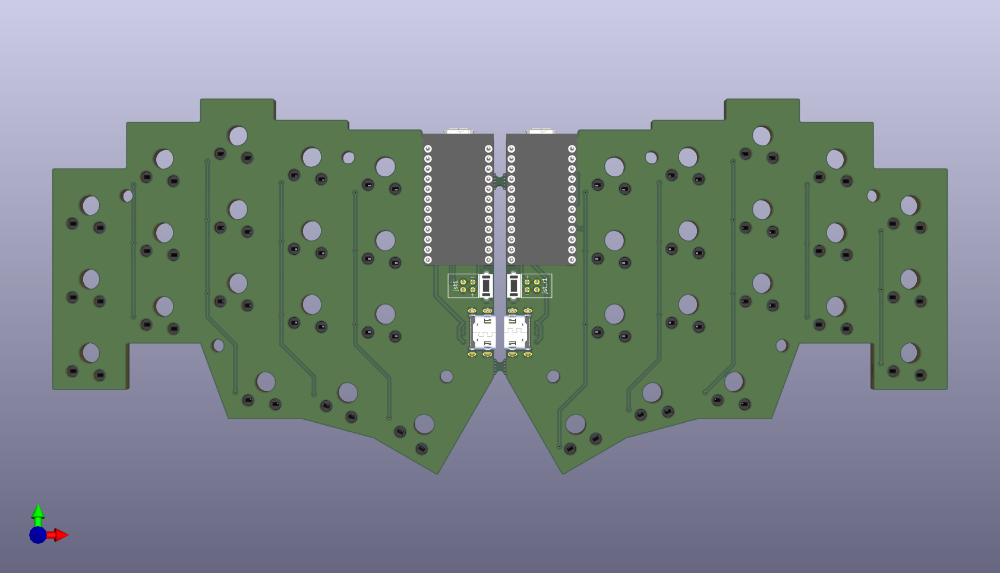
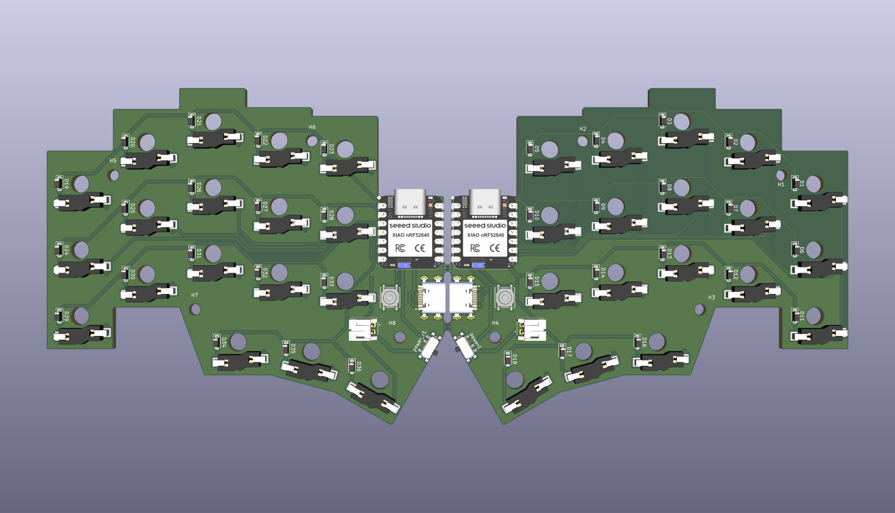
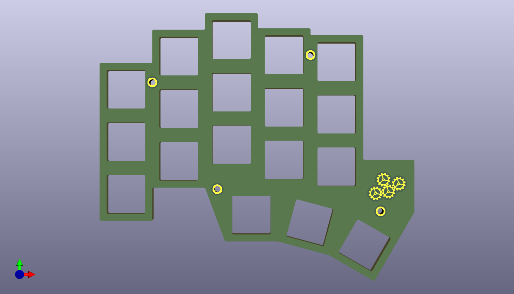
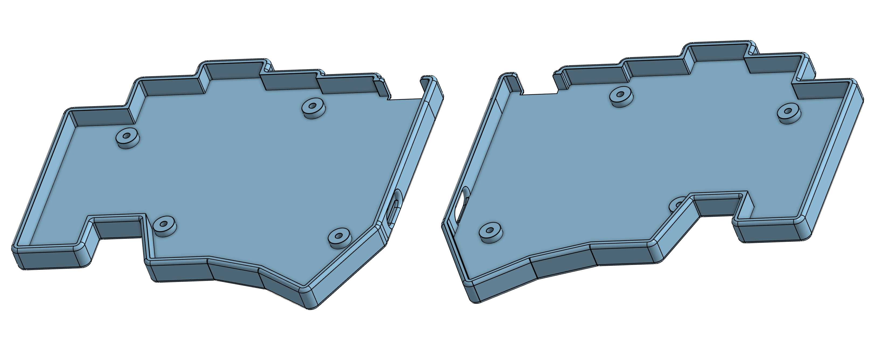

# Just Another Keyboard
It's Just Another Keyboard that amalgamates the [Corne](github.com/foostan/crkbd), [Ferris Sweep](https://github.com/davidphilipbarr/Sweep), and [Fifi](https://github.com/raychengy/fifi_split_keeb).

**Notable Features:**
- Pro Micro support (including [nice!nano](https://nicekeyboards.com/nice-nano/)) for wireless builds.
- 2-pin JST connector for the battery in wireless builds.
    - The top connector is for a [110mAh 301230 Lithium Battery](https://typeractive.xyz/products/lithium-battery-110mah) (which fits under the Pro Micro).
    - The bottom connector is for any larger battery (such as a [750mAh 403450 Lithium Battery](typeractive.xyz/products/lithium-battery-750mah)).
- USB-C full duplex USART communication for wired builds. None of that [TRRS nonesense](https://gabevenberg.com/posts/stop-using-trrs/)!

***\*Build instructions (and a ZMK module + possibly a QMK addition) coming in a few weeks when I get the board.***

## Links (temp)
- `USB-C Connector` - https://www.digikey.com/en/products/detail/gct/USB4505-03-0-A/15283201

## PCB

PCB front

PCB back

## Switch Plate
Can be found [here](./switch-plate/).

Switch plate (mirrored on other side)

## 3D Print Case
[Left](./case/case-left.step) and [right](./case/case-right.step) case files.

Includes a gap for the power switch at the top, holes for the side USB-C ports, and M2 screw receivers
