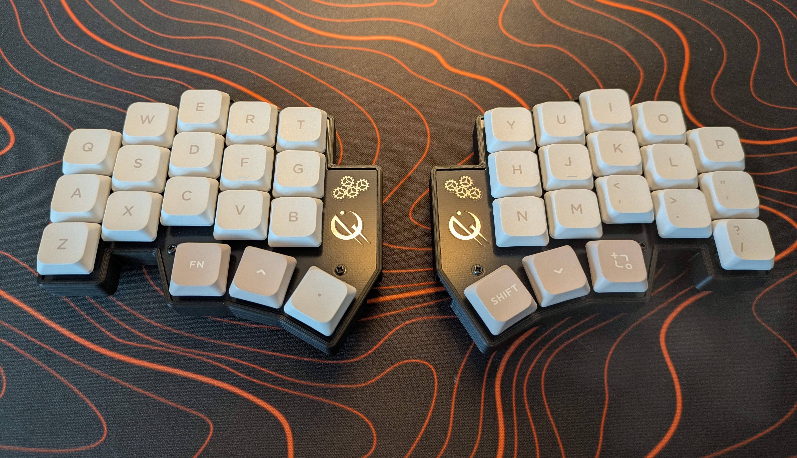

# Just Another Keyboard
It's Just Another Keyboard that amalgamates the [Corne](github.com/foostan/crkbd), [Ferris Sweep](https://github.com/davidphilipbarr/Sweep), and [Fifi](https://github.com/raychengy/fifi_split_keeb).

Fully assembled wireless version with [keycaps from Nuphy](https://nuphy.com/collections/keycaps/products/coast-dawn-nsa)

**Notable Features:**
- Designed for [Gateron KS-33 Low Profile Switches](https://www.gateron.co/products/gateron-low-profile-mechanical-switch-set) with hotswap sockets

- [Seeed Studio XIAO](https://www.seeedstudio.com/XIAO-RP2040-v1-0-p-5026.html) support (including the `XIAO-BLE` for wireless builds)

- 2-pin JST connector for the battery in wireless builds

- USB-C full duplex USART communication[^1] for wired builds. None of that [TRRS nonesense](https://gabevenberg.com/posts/stop-using-trrs/)!

- [Switch plates](./switch-plate/) you can order with the PCB

- [3D printable cases](./case/) that exactly fit the boards with a battery or USB-C connectors

## Build Guide
Refer to the [Build Guide](./docs/build_guide.md).

## Firmware Guide
### ZMK
You can use ZMK with either the wired or wireless version of the keyboard[^2].

- Follow the [usual setup steps for ZMK](https://zmk.dev/docs/user-setup).

- Add the `zmk-keyboards-jak` module by following the instructions on the [module's GitHub](https://github.com/drewlwhitney/zmk-keyboards-jak).

- Build and flash the firmware.

### QMK
You can use QMK with the wired version **only**.

TODO: To be written when I build and test the wired version.

[^1]: At the moment, the wired connection is untested. I have only built the bluetooth version.

[^2]: In theory. ZMK has experimental support for wired split full duplex USART, but I have not built the wired version yet so I cannot test this. I will eventually test this, I promise.