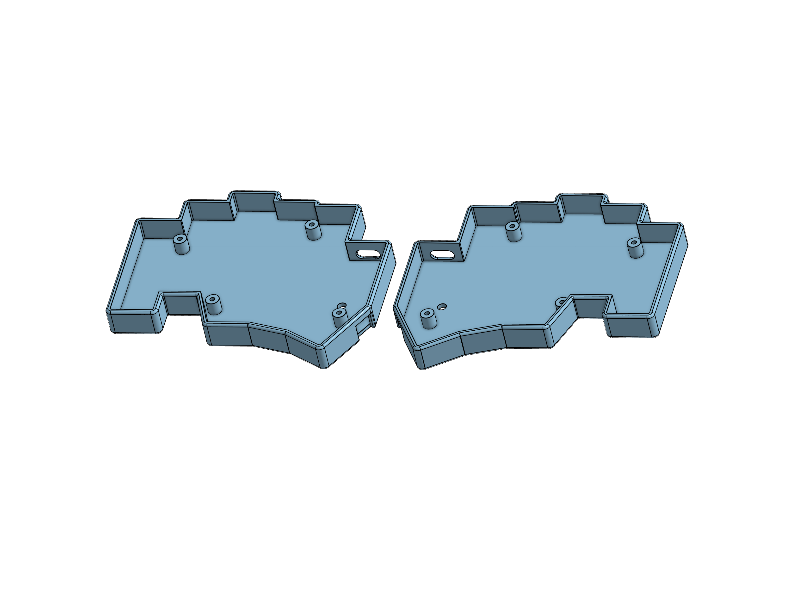
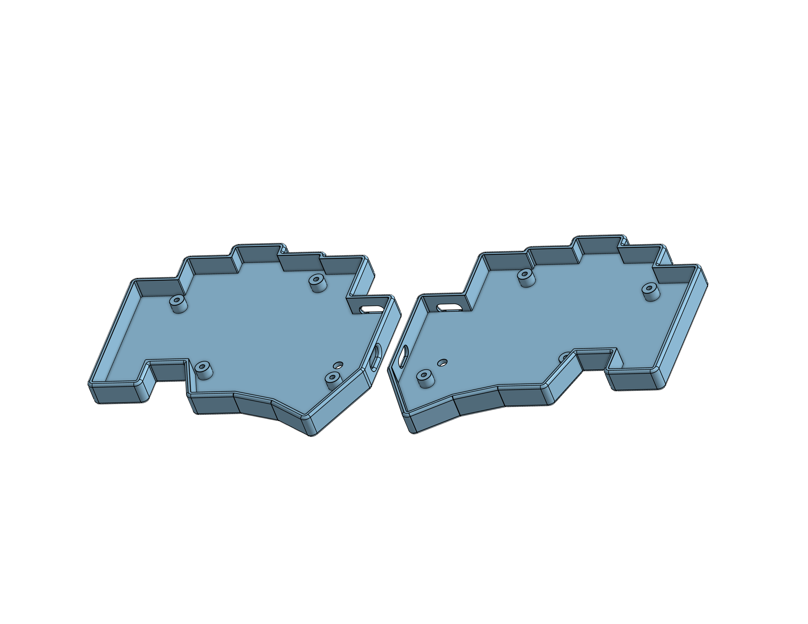

# Case
Left and right case files which can be 3D printed. There are two versions: one for a wired build and one for a wireless build.

## Wireless
Use the [wireless left](./left-wireless.step) and [wireless right](./right-wireless.step) files. This version omits holes for the split USB-C connectors and adds holes for the power switches. It is tall enough to fit a battery on the underside of the PCB.

This case uses 10mm M2 screws.

## Wired
Use the [wired left](./left-wired.step) and [wired right](./right-wired.step) files. This version omits holes for the power switch and adds holes for the split USB-C connectors. It is tall enough to exactly fit the switch plate and PCB (with components) with nothing underneath.

This case uses 8mm M2 screws.

