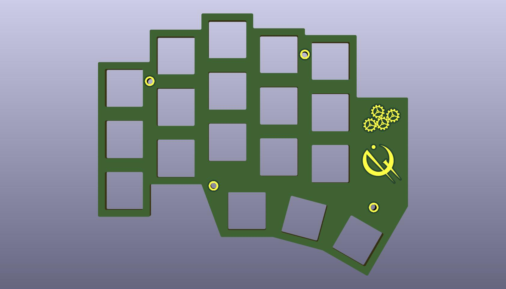
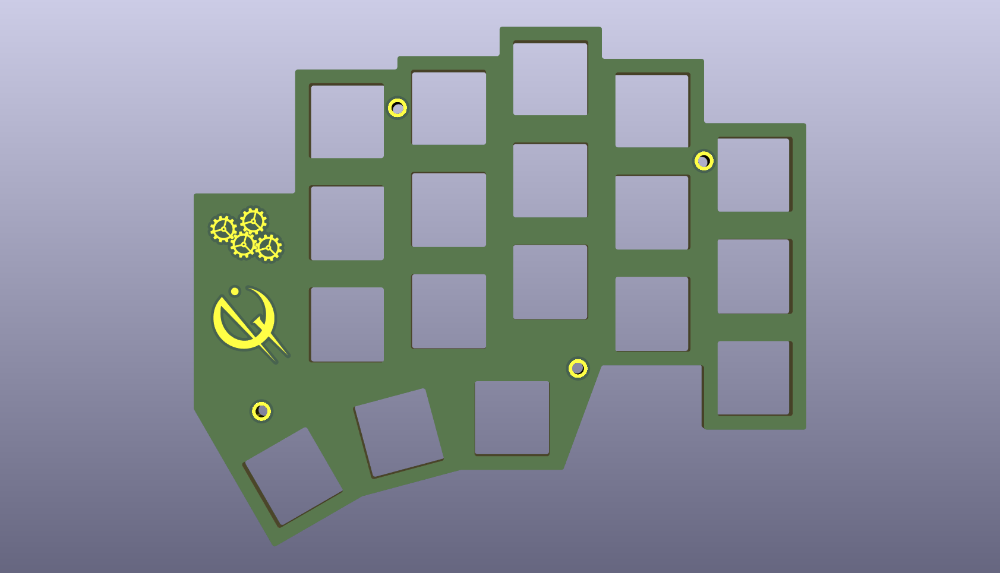
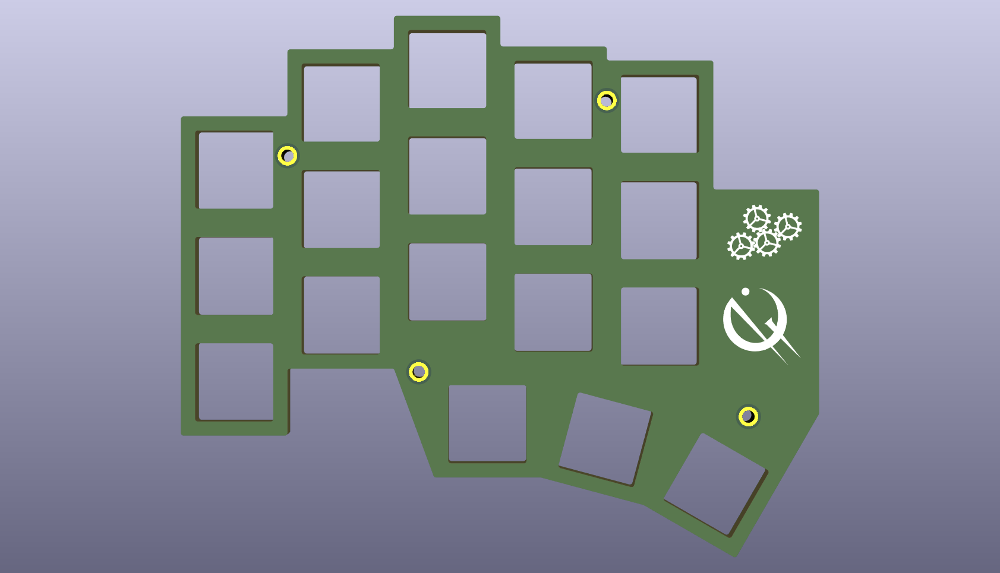

# Switch Plate
There are two versions of the switch plate:
- [`switch-plate-left`](./switch-plate-left/) and [`switch-plate-right`](./switch-plate-right/) - Non-reversible switch plates that have decorative markings made out of exposed metal. The metal markings look very cool, but they can only be on the top side of the plate because the exposed metal could short the battery terminals if they were on the bottom. You need to order both the left and right plates.  

- [`switch-plate-safe`](./switch-plate-safe/) - A reversible switch plate that moves the decorative markings to the silkscreen. You only need to order one set (i.e. get at least two plates and then flip one over). 

Both plates are designed for MX-style switches (including the Gateron KS-33 Low Profile Switches).

## Ordering
This was written on January 23, 2026 for [JLCPCB](https://jlcpcb.com/).

If using the left and right switch plates, you'll need two sets of Gerber files: one for the [left](./switch-plate-left/gerbers/) and one for the [right](./switch-plate-right/gerbers/). If using the reversible switch plate, you only need [this one](./switch-plate-safe/gerbers/).

Upload the [PCB Gerber Files (.zip)](./gerber_to_order/) to [JLCPCB](https://cart.jlcpcb.com/quote), then leave everything as-is except for:

| Option | Value |
| -- | -- |
| PCB Color | Your choice |
